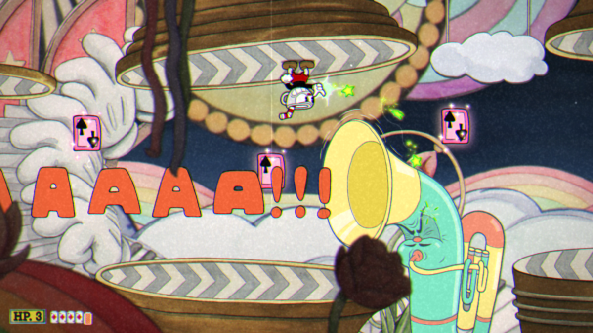

<!-- GENERAL GAME INFO -->
 

  <h1 align="center">Cuphead</h1>

  

    Cuphead is a 2017 side-scrolling run and gun video game developed and published by Studio MDHR.
     
    <strong>Original game : </strong>
    <a href="https://en.wikipedia.org/wiki/Cuphead"><strong>General info »</strong></a>
    ·
    <a href="https://www.youtube.com/watch?v=qMA11zEC9S4"><strong>Youtube video »<strong></a>
     
     
  

<!-- TABLE OF CONTENTS -->

  
Table of Contents

  <ol>
    <li>
      <a href="#about-the-project">About The Project</a>
    </li>
    <li>
      <a href="#my-version">My version</a>
    </li>
    <li>
      <a href="#getting-started">Getting Started</a>
    </li>
    <li><a href="#how-to-play">How To Play</a></li>
    <li><a href="#class-structure">Class structure</a></li>
    <li><a href="#checklist">Checklist</a></li>
    <li><a href="#contact">Contact</a></li>
    <li><a href="#acknowledgments">Acknowledgments</a></li>
  </ol>

<!-- ABOUT THE PROJECT -->
## About The Project

Here's why:
* The graphics are stunning
* The game is fun and challenging
* Making the game itself is a challenge

(<a href="#readme-top">back to top</a>)

## My version

This section gives a clear and detailed overview of which parts of the original game I planned to make.

### The minimum I will most certainly develop:
* Level scrolling and camera wave movement
* Both weapons
* Powers and resources
* Basic movement
* Main menu

### What I will probably make as well:
* Flawless animations
* Good AI
* Good sound implementation

### What I plan to create if I have enough time left:
* Tutorial mission
* Polishing the game

(<a href="#readme-top">back to top</a>)

<!-- GETTING STARTED -->
## Getting Started
Detailed instructions on how to run your game project are in this section.

### Prerequisites

To run this project you will need the following software:
* Visual Studio 2022

### How to run the project

Explain which project (version) must be run.
* any extra steps if required 

(<a href="#readme-top">back to top</a>)

<!-- HOW TO PLAY -->
## How to play

Use this space to show useful examples of how a game can be played. 
Additional screenshots and demos work well in this space. 

### Controls
* LEFT/RIGHT ARROWS to move
* DOWN ARROW to duck (inverted if gravity inverted)
* SPACE to jump
* LSHIFT to dash
* A to shoot
* Z to dash
* X to switch weapons
* ESC to pause (Controls screen)
* Hold Q to quit the level

(<a href="#readme-top">back to top</a>)

<!-- CLASS STRUCTURE -->
## Class structure 

### Object composition 
The ResourcesLinker (class that initializes and links textures) is aggregated in the StageManager (class that initializes, updates and manages all entities).
The linked textures themselved are aggregated to the entities by the ResourceManager.
The Camera is associated with the StageManager.

StageManager has a PlatformManager as part of the composition.

Cuphead (player class) has a WeaponManager and a MovementManager as part of the composition.
All entities that shoot have a BulletManager or Bullet entities as part of the composition.
All entities also have the composition about the texture and animation management.

### Inheritance 
The basic abstract TextureManager is the parent of SpriteManager, PatternManager. These classes generate and make use of textures in the game.

TexturedModel is the base class for all entities. It splits into NonInterractableProp and Entities. 
Entities will have all gameplay characters as children.
Enemies, child of entities, will have all enemies as children.

All Entities are also children of the CollisionEntity class, which provides collision detection and resolution.

Weapons (like peashooter or spread) are children of the Weapon class.

All screen managers are children of the ScreenManager class.

### ..

(<a href="#readme-top">back to top</a>)

<!-- CHECKLIST -->
## Checklist

- [x] Accept / set up github project
- [x] week 01 topics applied
    - [x] const keyword applied proactively (variables, functions,..)
    - [x] static keyword applied proactively (class variables, static functions,..)
    - [x] object composition (optional)
- [x] week 02 topics applied
- [x] week 03 topics applied
- [x] week 04 topics applied
- [x] week 05 topics applied
- [x] week 06 topics applied
- [x] week 07 topics applied
- [x] week 08 topics applied
- [x] week 09 topics applied (optional)
- [x] week 10 topics applied (optional)

(<a href="#readme-top">back to top</a>)

<!-- CONTACT -->
## Contact

Manzini Alessandro - alessandro.manzini@student.howest.be

Project Link: [https://github.com/HowestDAE/DAE13-alessandromanzini](https://github.com/HowestDAE/DAE13-alessandromanzini)

(<a href="#readme-top">back to top</a>)

<!-- ACKNOWLEDGMENTS -->
## Acknowledgments

Use this space to list resources you find helpful and would like to give credit to. 

* [All the game sprites on Spriters Resource](https://www.spriters-resource.com/pc_computer/cupheaddontdealwiththedevil/)
* [Deleting list item while iterating](https://stackoverflow.com/questions/16269696/erasing-while-iterating-an-stdlist/)

(<a href="#readme-top">back to top</a>)

