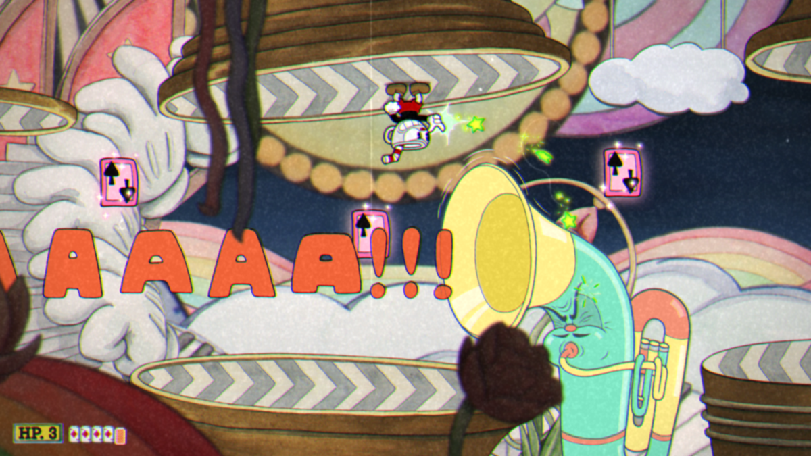

<!-- GENERAL GAME INFO -->
 

  <h1 align="center">Cuphead</h1>

  

    Cuphead is a 2017 side-scrolling run and gun video game developed and published by Studio MDHR.
     
    <strong>Original game : </strong>
    <a href="https://en.wikipedia.org/wiki/Cuphead"><strong>General info »</strong></a>
    ·
    <a href="https://www.youtube.com/watch?v=qMA11zEC9S4"><strong>Youtube video »<strong></a>
     
     
  

<!-- TABLE OF CONTENTS -->

  
Table of Contents

  <ol>
    <li>
      <a href="#about-the-project">About The Project</a>
    </li>
    <li>
      <a href="#my-version">My version</a>
    </li>
    <li>
      <a href="#getting-started">Getting Started</a>
    </li>
    <li><a href="#how-to-play">How To Play</a></li>
    <li><a href="#class-structure">Class structure</a></li>
    <li><a href="#checklist">Checklist</a></li>
    <li><a href="#contact">Contact</a></li>
    <li><a href="#acknowledgments">Acknowledgments</a></li>
  </ol>

<!-- ABOUT THE PROJECT -->
## About The Project

Here's why:
* The graphics are stunning
* The game is fun and challenging
* Making the game itself is a challenge

(<a href="#readme-top">back to top</a>)

## My version

This section gives a clear and detailed overview of which parts of the original game I planned to make.

### The minimum I will most certainly develop:
* Level scrolling and camera stop
* Weapons
* Powers and resources
* Fighting
* Main menu

### What I will probably make as well:
* Flawless animations
* Good IA
* Good sound implementation

### What I plan to create if I have enough time left:
* Tutorial mission
* Polishing the game

(<a href="#readme-top">back to top</a>)

<!-- GETTING STARTED -->
## Getting Started
Detailed instructions on how to run your game project are in this section.

### Prerequisites

To run this project you will need the following software:
* Visual Studio 2022

### How to run the project

Explain which project (version) must be run.
* any extra steps if required 

(<a href="#readme-top">back to top</a>)

<!-- HOW TO PLAY -->
## How to play

Use this space to show useful examples of how a game can be played. 
Additional screenshots and demos work well in this space. 

### Controls
* keys, .. 
* .. 

(<a href="#readme-top">back to top</a>)

<!-- CLASS STRUCTURE -->
## Class structure 

### Object composition 
If you applied object composition (optional); explain where and how.

### Inheritance 
Explain where you applied inheritance (mandatory).

### ..

(<a href="#readme-top">back to top</a>)

<!-- CHECKLIST -->
## Checklist

- [x] Accept / set up github project
- [ ] week 01 topics applied
    - [ ] const keyword applied proactively (variables, functions,..)
    - [ ] static keyword applied proactively (class variables, static functions,..)
    - [ ] object composition (optional)
- [ ] week 02 topics applied
- [ ] week 03 topics applied
- [ ] week 04 topics applied
- [ ] week 05 topics applied
- [ ] week 06 topics applied
- [ ] week 07 topics applied
- [ ] week 08 topics applied
- [ ] week 09 topics applied (optional)
- [ ] week 10 topics applied (optional)

(<a href="#readme-top">back to top</a>)

<!-- CONTACT -->
## Contact

Manzini Alessandro - alessandro.manzini@student.howest.be

Project Link: [https://github.com/HowestDAE/DAE13-alessandromanzini](https://github.com/HowestDAE/DAE13-alessandromanzini)

(<a href="#readme-top">back to top</a>)

<!-- ACKNOWLEDGMENTS -->
## Acknowledgments

Use this space to list resources you find helpful and would like to give credit to. 

* [All the game sprites on Spriters Resource](https://www.spriters-resource.com/pc_computer/cupheaddontdealwiththedevil/)
* ..

(<a href="#readme-top">back to top</a>)

